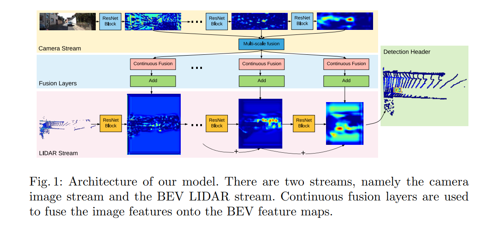

# Deep_Continuous_Fusion_for_Multi-Sensor_3D_Object_Detection

*Caution: Its unofficial algorithm and under construction. we will make total architecture soon.

reference: Deep Continuous Fusion for Multi-Sensor 3D Object Detection (Ming Liang et.al. , ECCV 2018)

## Overall




## How to use it

### Data directory 

Data parse is in data_import_carla.py. You can change other dataset by changing Dataset class. 

### Training

```
$ python3.5 train.py
```

### Testing

```
$ python3.5 test.py
```
